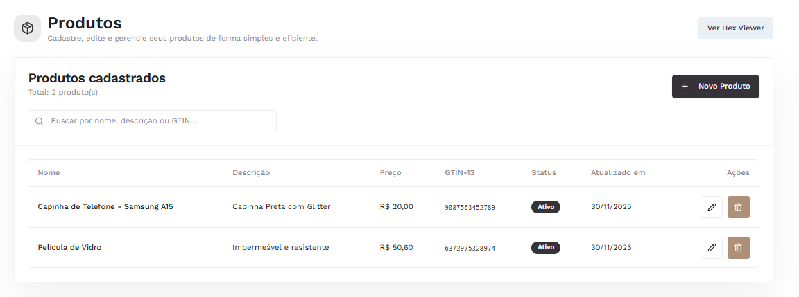
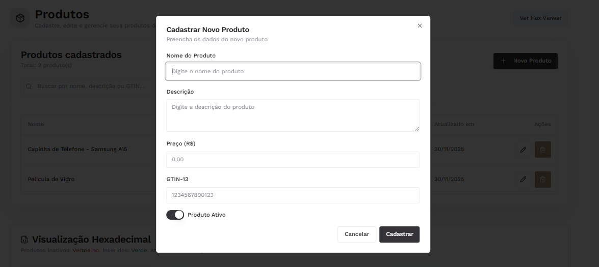
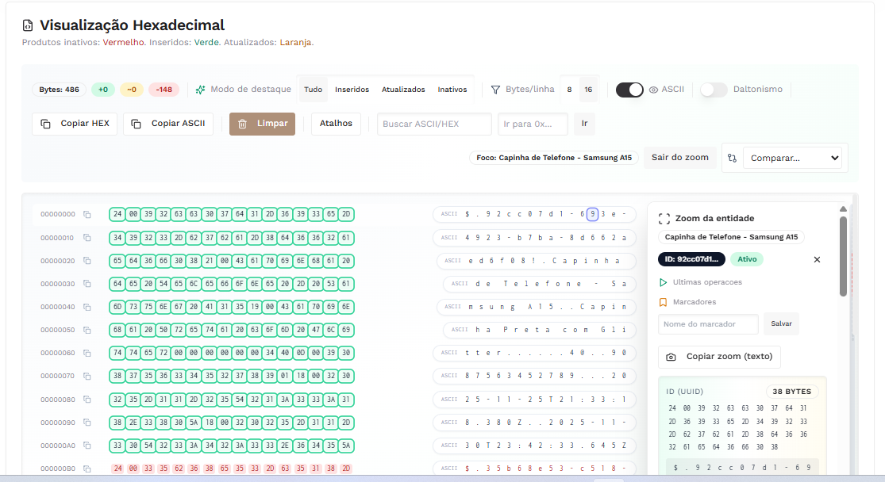
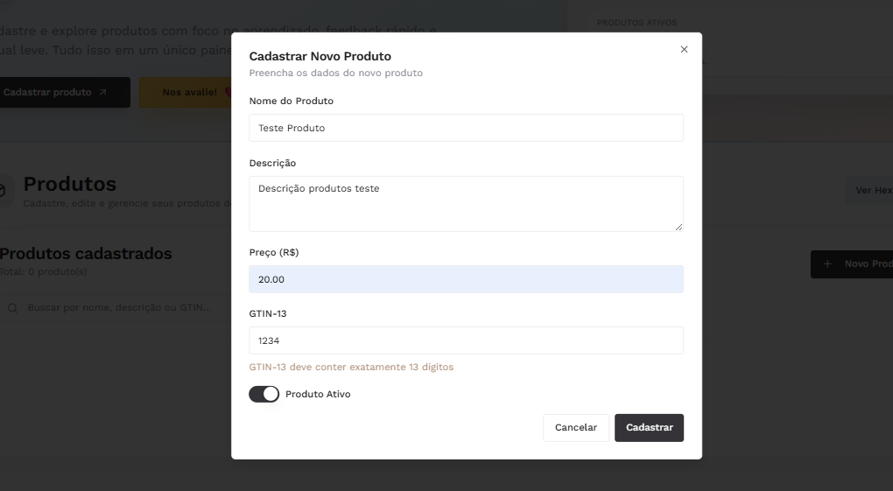
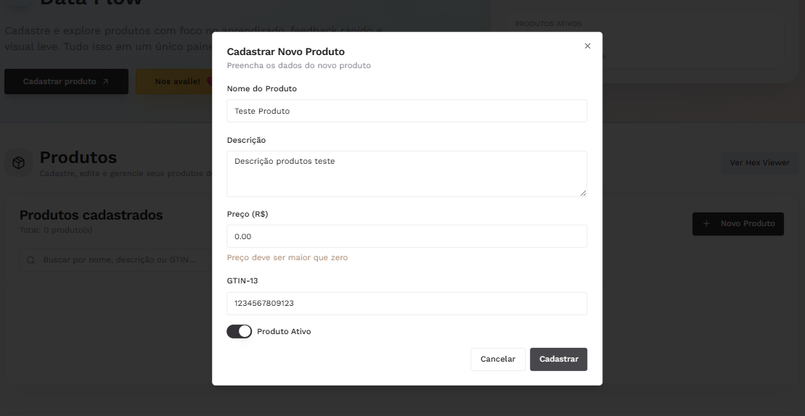
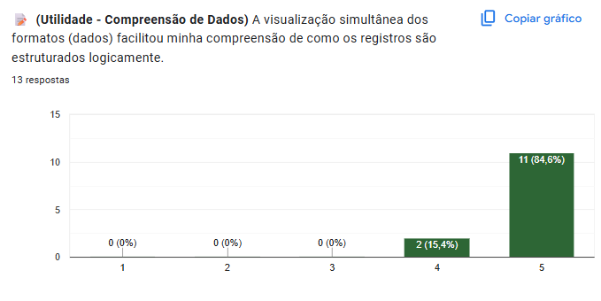
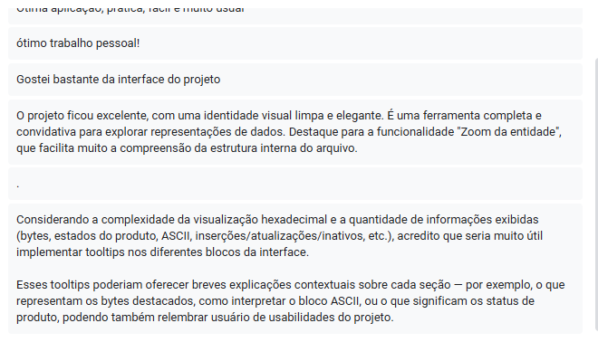

  

<h1 align="center">PONTIFÍCIA UNIVERSIDADE CATÓLICA DE MINAS GERAIS</h1>
<h3 align="center">Instituto de Ciências Exatas e de Informática</h3>
<h3 align="center">Curso de Ciência da Computação</h3>

 

# Relatório Trabalho Prático 04: Sistema de Gestão e Visualização de Dados
## Algoritmos e Estruturas de Dados III

### Autores

  * **Bernardo Ladeira Kartabil**
       \* `bernardo.kartabil@sga.pucminas.br`
  * **Marcella Santos Belchior**
      \* `marcella.belchior@sga.pucminas.br`
  * **Thiago Henrique Gomes Feliciano**
      \* `1543790@sga.pucminas.br`
  * **Yasmin Torres Moreira dos Santos**
      \* `yasmin.santos.1484596@sga.pucminas.br`

-----

## 📝 Descrição Completa do Sistema

Este projeto consiste em uma Aplicação Web (Single Page Application) desenvolvida para simular e visualizar o comportamento de um sistema de gerenciamento de arquivos (CRUD) de produtos.

O principal objetivo pedagógico da aplicação é a exibição em tempo real de como os dados estruturados (objetos lógicos) são traduzidos para formatos de armazenamento físico e lógico. 

O sistema utiliza a API `localStorage` do navegador para persistir os dados, garantindo que o "banco de dados" não seja perdido ao recarregar a página, simulando o comportamento de gravação em disco.

---

## 📸 Capturas de Tela (Screenshots)

### 1. Visão Geral e Cadastro

*Demonstração do formulário e da tabela de produtos ativos.*

### 2. Visualização Binária e JSON

*Detalhe das tabelas de inspeção de dados (Hex e Char) e a estrutura JSON gerada.*

### 3. Validações e Erros

*Exemplo de alerta do sistema ao tentar cadastrar um produto com GTIN inválido e preço inválido.*

---

## 💻 Classes e Estrutura do Código

O sistema foi desenvolvido utilizando React (JavaScript/TypeScript) para criar uma arquitetura componentizada e manutenível. Embora utilize uma biblioteca moderna, a aplicação se baseia estritamente nos padrões web fundamentais, renderizando HTML5 semântico e CSS3 para estilização.

A estrutura de pastas (`src/`) organiza as responsabilidades da seguinte forma:

* **`components/` (Interface & HTML):** Contém os blocos de construção da interface.
    * **`ProductManagement.tsx`:** Controlador principal que gerencia o estado da tela.
    * **`HexViewer.tsx`:** Responsável pela lógica visual complexa das tabelas Binária e de Decodificação.
    * **`ProductForm.tsx`** e **`ProductTable.tsx`:** Componentes puros para entrada e exibição de dados.

* **`lib/` (Lógica JS Pura):** Módulos utilitários que não dependem da interface.
    * **`productStorage.ts`:** Gerencia as operações de CRUD diretamente no `localStorage`.
    * **`binaryProducts.ts`:** Realiza a conversão matemática de dados (JSON) para representação hexadecimal.

* **`types/` (Definições):** Garante a integridade dos dados através de interfaces TypeScript (`Product`), assegurando que o JavaScript manipule objetos consistentes.

---

## ⚙️ Operações Especiais Implementadas

Para atender aos requisitos de robustez e clareza didática, implementamos as seguintes lógicas:

1.  **Visualização Hexadecimal Interativa:**
    * Ao passar o mouse (*hover*) sobre um byte na tabela hexadecimal, o sistema destaca automaticamente o caractere correspondente na tabela de texto (e vice-versa). Isso facilita a compreensão espacial de como cada caractere ocupa um byte na memória.

2.  **Validação de GTIN-13:**
    * Implementação de uma verificação estrita que impede o cadastro de códigos que não possuam exatamente 13 dígitos numéricos, garantindo a integridade dos dados simulados.

3.  **Sincronização em Tempo Real:**
    * Toda vez que um registro é salvo, editado ou excluído, o sistema recalcula automaticamente a representação binária de todo o banco de dados, simulando a reescrita do arquivo.

4.  **Persistência Automática:**
    * Uso do `localStorage` para manter o estado da aplicação entre sessões, permitindo que o usuário feche e reabra o navegador sem perder os dados cadastrados.

---
## 📊 Avaliação de Usabilidade e Utilidade

Para validar a eficácia da aplicação tanto como ferramenta pedagógica quanto como software funcional, realizamos um teste com usuários (alunos do curso de Computação).

### Metodologia
O teste foi conduzido seguindo um roteiro de tarefas (Cadastro, Validação de Erro, Edição e Análise Binária), seguido de um questionário baseado na **Escala Likert** (1 a 5), onde:
* **1:** Discordo Totalmente
* **5:** Concordo Totalmente

### Perguntas Aplicadas
As afirmativas avaliadas foram divididas entre **Usabilidade** (facilidade de uso) e **Utilidade** (valor pedagógico):

1.  **(Usabilidade)** As operações principais (Salvar, Editar, Excluir e Filtrar) foram fáceis de localizar e executar.
2.  **(Usabilidade)** As mensagens de erro foram claras e ajudaram a corrigir problemas.
3.  **(Utilidade)** A visualização simultânea (Tabela, JSON e Binário) facilitou a compreensão da estrutura dos dados.
4.  **(Utilidade)** O destaque visual (*hover*) ajudou a entender a relação entre o caractere e seu código hexadecimal.
5.  **(Usabilidade)** A interface é intuitiva, permitindo uso imediato sem tutoriais.
6.  **(Usabilidade)** O sistema manteve os dados salvos corretamente ao recarregar a página (Persistência).
7.  **(Geral)** De modo geral, estou satisfeito com a experiência de uso da aplicação.

### Resultados Obtidos

Abaixo, apresentamos a síntese das respostas coletadas.

#### Tabela de Médias por Item

| Item Avaliado | Média (1-5) | Categoria |
| :--- | :---: | :--- |
| 1. Facilidade CRUD | **5,0** | Usabilidade |
| 2. Clareza de Erros | **4,8** | Usabilidade |
| 3. Compreensão Estrutural | **4,6** | Utilidade |
| 4. Recurso Visual (Hover) | **5,0** | Utilidade |
| 5. Intuitividade | **4,8** | Usabilidade |
| 6. Persistência | **4,8** | Usabilidade |
| 7. Satisfação Geral | **5,0** | Geral |

* OBS: PDF com todos os gráficos das respostas incluso no Git do projeto (/Documents)

### Análise dos Dados

Com base nos dados coletados, observamos que:

> **Utilidade Pedagógica:** O recurso de destaque visual (*hover* sincronizado entre bytes e caracteres) obteve avaliação máxima (100% de concordância total). Os participantes relataram que a visualização simultânea e o "zoom da entidade" foram fundamentais para a compreensão concreta de como os dados são estruturados fisicamente.

> **Experiência de Uso:** A satisfação com a interface foi unânime (média 5,0), sendo descrita nos comentários como "limpa, prática e elegante". A alta intuitividade permitiu que todos os usuários realizassem as tarefas de cadastro e edição sem dificuldades ou necessidade de tutoriais externos.

> **Pontos de Melhoria:** Apesar da excelente recepção, foi sugerida a implementação de *tooltips* (balões de ajuda contextuais) nas áreas de visualização hexadecimal. Isso ajudaria usuários iniciantes a identificarem rapidamente o significado de bytes específicos (como flags de status e metadados) sem depender de dedução.

---

## ✅ Checklist Obrigatório

Abaixo, as respostas para os requisitos mandatórios do trabalho prático:

**1. A página web com a visualização interativa do CRUD de produtos foi criada?**
* **Resposta:** Sim.
* **Justificativa:** O sistema permite criar, ler, atualizar e deletar produtos com visualização imediata das alterações nas tabelas lógicas e físicas.

**2. Há um vídeo de até 3 minutos demonstrando o uso da visualização?**
* **Resposta:** Sim.
* **Justificativa:** O link do vídeo de demonstração encontra-se em video/link_video.txt.

**3. O trabalho foi criado apenas com HTML, CSS e JS?**
* **Resposta:** Sim.
* **Justificativa:** O projeto foi construído utilizando **React**, que é uma biblioteca **JavaScript**. O código foi estruturado em componentes para melhor organização, mas a execução final no navegador consiste puramente em HTML, CSS e JavaScript, sem uso de linguagens de servidor ou plugins externos que fujam do padrão web nativo.
  
**4. O relatório do trabalho foi entregue no APC?**
* **Resposta:** Ainda não, devido ao erro na exibição da tarefa.
* **Justificativa:** Este arquivo (README.md) constitui o relatório oficial do grupo.

**5. O trabalho está completo e funcionando sem erros de execução?**
* **Resposta:** Sim.
* **Justificativa:** Todas as funcionalidades e validações foram testadas conforme o roteiro de testes e estão operacionais.

**6. O trabalho é original e não a cópia de um trabalho de outro grupo?**
* **Resposta:** Sim.
* **Justificativa:** O código e o relatório foram desenvolvidos integralmente pelos membros listados acima.
